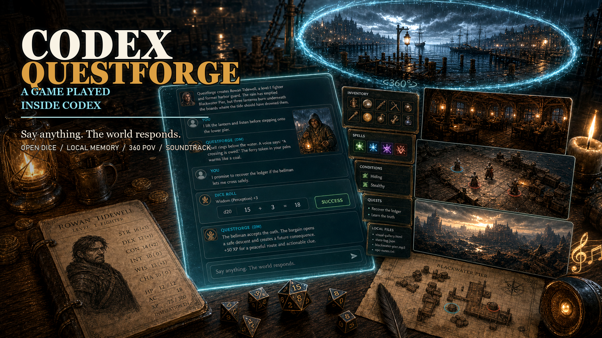

# Codex Questforge



**What if we did not just use Codex to build a game, but used Codex as the game itself?**

**Codex Questforge is a Codex-native fantasy RPG runner.** Codex becomes the play surface, Dungeon Master, rules assistant, local state engine, and visual table. Questforge turns a Codex thread into a persistent 5E-compatible campaign with quick character creation, open dice rolls, a local mechanical ledger, campaign memory, optional generated visuals, 360 scene viewers, and ambience support.

This is an unofficial alpha that started during the OpenAI Discord Codex game challenge. It is designed to be played inside Codex today, then improved in public.

**Guided sample session:** <https://adrianmelic.github.io/codex-questforge/>

The web page is a guided Codex-style sample, not the full game: click through a few representative player messages to see a simulated DM response, dice result, character state, visual gallery update, tactical map or 360 POV viewer, and optional ambience. The open-ended game runs inside Codex after installing the plugin, where you can say anything and Codex continues as the DM.

## What It Is

Codex Questforge is not a conventional browser game. The main game runs inside Codex: you talk naturally, Codex acts as the DM, and local files keep the campaign recoverable between turns and threads.

Core features:

- quick or assisted level-1 character creation;
- original fantasy campaigns grounded in SRD-compatible 5E rules;
- local SRD setup with Markdown, JSONL, and SQLite search indexes;
- persistent `game-state.json` for HP, AC, XP, inventory, equipment, shops, rests, spell slots, combat, conditions, death saves, and checkpoints;
- campaign memory files for clues, NPCs, factions, locations, session logs, player journal, and DM-only adventure spine;
- open dice rolls and failure-forward adjudication;
- optional native Codex image generation for scenes, maps, items, comic panels, inventory views, and 360 POV panoramas;
- local visual gallery and panorama viewer for generated campaign images;
- optional licensed ambience pack with speaker-toggle playback in viewers;
- preflight and self-play scripts for testing campaign readiness.

## How To Play

Install or enable the plugin in Codex, open a new Codex thread, and start with one of these prompts:

```text
I want to play @questforge in English. Create a quick character and start.
```

```text
I want to play @questforge. I am new to D&D; guide me through a character with a few choices, then start the first scene.
```

```text
Quiero jugar a @questforge en español. Créame un personaje rápido y empezamos.
```

Controls are natural language. You can say what your character attempts, ask what you can do, inspect inventory, request a rollback to the last checkpoint, ask for a rules explanation, or continue the story in any direction that makes sense.

Questforge has been tested in English and Spanish. Players are encouraged to try their own language; first-run setup detects language automatically and can download the public 5E SRD 5.2.1 PDF locally, so the first campaign setup can take a little longer.

## Install In Codex

Fastest path if you are already using Codex:

```text
Install the Questforge plugin from https://github.com/adrianmelic/codex-questforge, then start a new thread so I can play @questforge.
```

This repository is the plugin folder: the repo root contains
`.codex-plugin/plugin.json` and `skills/...`, which matches the standard Codex
plugin layout. Codex also needs a marketplace entry that points at the plugin
folder.

For the default personal marketplace, clone Questforge to the path Codex expects
from `~/.agents/plugins/marketplace.json`:

```powershell
New-Item -ItemType Directory -Force "$env:USERPROFILE\plugins"
git clone https://github.com/adrianmelic/codex-questforge.git "$env:USERPROFILE\plugins\questforge"
```

```bash
mkdir -p "$HOME/plugins"
git clone https://github.com/adrianmelic/codex-questforge.git "$HOME/plugins/questforge"
```

If you cloned the repo somewhere else, move it there or create a junction/symlink
so `~/plugins/questforge` points at your clone.

Make sure your personal marketplace file contains an entry for Questforge. The
personal marketplace file is normally `~/.agents/plugins/marketplace.json`
(`C:\Users\<you>\.agents\plugins\marketplace.json` on Windows), and Codex
discovers it automatically:

```json
{
  "name": "personal",
  "interface": {
    "displayName": "Personal"
  },
  "plugins": [
    {
      "name": "questforge",
      "source": {
        "source": "local",
        "path": "./plugins/questforge"
      },
      "policy": {
        "installation": "AVAILABLE",
        "authentication": "ON_INSTALL"
      },
      "category": "Games"
    }
  ]
}
```

Then install the plugin:

```powershell
codex plugin add questforge@personal
```

Start a new Codex thread after installation so the Questforge skills are loaded.

Reference: OpenAI's
[Codex plugin docs](https://developers.openai.com/codex/plugins/build#create-a-plugin-manually)
describe the same three-part shape: plugin folder with
`.codex-plugin/plugin.json`, skills under `skills/...`, and a marketplace entry
that points to the plugin folder.

## First-Run Rules Setup

Questforge can download and index the official SRD 5.2.1 PDF into a local `.questforge/` cache. Run this from the project folder where you want campaign files:

```powershell
python scripts\questforge_setup.py --data-dir .questforge --install-pdf-extractor
```

The setup command detects language automatically and currently supports English and Spanish SRD resources:

```powershell
python scripts\questforge_setup.py --data-dir .questforge --install-pdf-extractor --language en
python scripts\questforge_setup.py --data-dir .questforge --install-pdf-extractor --language es
```

The downloaded SRD cache is local runtime data. Do not commit `.questforge/`.

## What Codex Helped With

Codex helped design, implement, and test the whole loop:

- plugin and skill architecture;
- SRD setup and local rules indexing;
- campaign memory templates;
- structured mechanical game ledger;
- dice, difficulty classes, and failure-forward check helpers;
- visual planning, gallery, and 360 panorama viewer;
- audio library selection and optional ambience playback;
- narrative-lint guardrails for avoiding repetitive AI-fiction motifs;
- deterministic self-play and human beta review workflows;
- installed-plugin smoke tests in English and Spanish.

The alpha was developed through iterative playtests where Codex both ran the game and audited the resulting files.

## Current Alpha Caveats

- Quick-start heroes work, but some state enrichment is still manual inside the orchestration layer.
- Combat, level-up, shops, and long-term companion play are implemented as ledgers and guidance, but need more human beta mileage.
- Native image generation is intentionally requested through Codex/ChatGPT, not the OpenAI API.
- The local gallery and 360 viewers work best on desktop; static generated images should still be shown in the Codex conversation for mobile play.
- This is an unofficial fan tool, not an official Dungeons & Dragons product.

## Test

```powershell
python -m pytest tests
```

Current test status:

```text
95 passed
```

## Repository Map

- `.codex-plugin/plugin.json` - Codex plugin manifest.
- `skills/questforge/SKILL.md` - main runtime behavior.
- `skills/questforge-setup/SKILL.md` - first-run setup and SRD language.
- `skills/questforge-rules/SKILL.md` - SRD lookup, dice, DCs, and rulings.
- `skills/questforge-campaign/SKILL.md` - campaign memory and continuity.
- `skills/questforge-puzzles/SKILL.md` - non-blocking deduction beats.
- `skills/questforge-visuals/SKILL.md` - visual cadence, image prompts, gallery, and 360 viewers.
- `scripts/` - setup, rules search, dice, game state, campaign memory, visual, audio, analytics, and preflight helpers.
- `templates/` - starter campaign, journal, state, visual, audio, and puzzle files.
- `docs/` - design notes, playtest protocol, visual playbook, beta rubrics, social post drafts, and video outline.
- `assets/audio/starter-pack/` - optional Suno-generated ambience tracks.

## Privacy

Questforge stores campaign state, SRD indexes, generated prompts, logs, images, and optional audio files locally in the folder where you play. Do not commit private campaigns, `.questforge/`, generated images, or personal play logs unless you intend to publish them.

## Terms

Use Questforge at your own table and risk. It is an alpha game/tool for local Codex play. Generated stories, images, and audio may depend on the services you choose to use and their terms.

## License And Notices

Code and original plugin materials are MIT licensed. See `LICENSE`.

Questforge is unofficial and is not affiliated with, endorsed, sponsored, or approved by Wizards of the Coast LLC. Rules references should be grounded in SRD material released under Creative Commons Attribution 4.0 International. See `NOTICE.md` and `docs/srd-sources.md`.

The starter audio pack contains curated Suno-generated tracks produced by Adrian Melic for this project on a paid Suno plan. See `assets/audio/README.md`.
