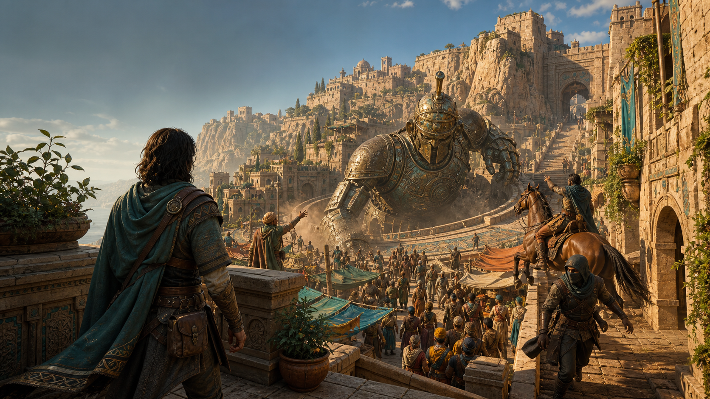

# Questforge



## Say anything. The world keeps up.

**Questforge is an open-ended, 5E-compatible fantasy RPG played inside Codex.** Codex becomes the Game Master, rules referee, campaign memory, and visual table. You speak naturally; Questforge prepares an original campaign, resolves meaningful uncertainty in the open, and remembers what your choices changed.

This is not a browser game that happens to use Codex. **The conversation is the game.**

[Explore Questforge](https://adrianmelic.com/questforge) | [Install it in ChatGPT](https://chatgpt.com/plugins/plugins_6a611d2ff7b88191b75a5290bceb0e87) | [Read the installation guide](docs/install-and-play.md)

## Start Playing

Install or enable Questforge, start a new task so the skills are loaded, and say:

```text
I want to play @questforge. Create a quick hero and begin.
```

Or ask for an assisted hero:

```text
I am new to tabletop RPGs. Guide me through creating a hero, then begin.
```

Questforge follows the language of the conversation. English and Spanish have bundled rules primers; other languages use the English rules index when a localized SRD term is unavailable.

## What Play Feels Like

1. **You act freely.** Investigate, bargain, cast, fight, flee, improvise, ask out of character, or attempt something the Game Master did not anticipate.
2. **The table resolves uncertainty.** Meaningful checks show the ability or attack, modifier, DC or opposing result, advantage state, natural roll, total, and outcome.
3. **The world changes.** HP, XP, inventory, equipment, spell slots, clues, NPC attitudes, faction pressure, clocks, rewards, and consequences become durable state.
4. **The next beat becomes visible.** When native image generation is available, useful scene images appear once in the same conversation and are also registered in the local campaign gallery.

Failures move the fiction forward with costs or harder choices. Repeated bad rolls do not trap the player at the same obstacle. Combat, shops, rests, level-ups, death saves, checkpoints, and table-style rewinds are supported without turning the campaign into a fixed dialogue tree.

## Where You See And Hear The Game

Questforge has a portable conversation layer and an enhanced local desktop layer.

| Surface | Player experience |
| --- | --- |
| **Conversation** | Narration, dialogue, visible dice, rulings, compact state, inventory and spell status, choices, and freeform actions. Static generated scenes are shown here when native image generation is available, including on mobile-capable conversation surfaces. |
| **Local Codex workspace** | Persistent campaign files, journals, clues, NPCs, factions, mechanical state, checkpoints, analytics, and a live visual table that can stay open beside the story and follow new assets. |
| **Local 360 viewer** | Important spatial moments can open as standalone `file:///` photospheres with natural drag direction, inertial movement, smooth zoom, and keyboard controls; no local server is required. |
| **Optional soundtrack** | A scene-appropriate approved track can be attached when the viewer is first created. Audio never starts for a new player by default; the speaker toggle is voluntary and its preference is remembered by later viewers when the browser permits it. |

If a surface has no writable filesystem or local browser, Questforge keeps a compact campaign ledger in the conversation and skips galleries, 360 viewers, and local checkpoints without pretending they were created. Play continues.

## Why Campaigns Do Not Start From The Same Template

Every new campaign begins with a private creative conception pass. Questforge considers several materially different possibilities, then establishes:

- environment, biome, climate, season, time, surface, and physical scale;
- community, social scale, livelihoods, and relationships between important NPCs;
- a material conflict, an active threat, faction pressure, and a concrete reason to act;
- tone, aesthetics, sensory palette, and the campaign's long-term promise;
- a minimum coherent Game Master spine with exactly three different clue routes and multiple plausible outcomes.

The bundled quick-start spec is deliberately neutral. It does not default to a port, rain, water, fog, darkness, or any other recurring environmental device, and it does not ban those elements when a specific campaign earns them. A local repetition audit compares recent campaign conceptions so a rename is not mistaken for an original premise.

## Core Capabilities

- quick, assisted, or imported/custom level-1 heroes;
- original 5E-compatible fantasy campaigns with transparent dice and rulings;
- offline English and Spanish rules indexes, with optional full SRD 5.2.1 indexing;
- persistent `game-state.json` for HP, AC, XP, inventory, equipment, shops, rests, spell slots, combat, conditions, death saves, and checkpoints;
- campaign memory for clues, NPCs, factions, locations, session logs, a player journal, and a Game Master-only adventure spine;
- failure-forward adjudication, varied difficulty classes, rewards beyond combat, and anti-stall pacing;
- generated scenes, tactical maps, items, reference plates, comic beats, inventories, merchants, outfits, recaps, and 360 POV panoramas;
- visual continuity for recurring characters, injuries, equipment, objects, locations, and maps;
- an optional original ambience pack licensed for redistribution by its creator;
- local analytics that distinguish generated visuals from pending prompts and surface repetitive DC or pacing patterns.

## Install From Source

Add this repository as a marketplace:

```text
codex plugin marketplace add adrianmelic/codex-questforge
```

Then open **Plugins** in the ChatGPT desktop app, or `/plugins` in a current Codex CLI, install Questforge, and start a new task. The repository includes `.agents/plugins/marketplace.json`, `.codex-plugin/plugin.json`, and the complete skills bundle.

You can also ask Codex:

```text
Install the Questforge plugin from https://github.com/adrianmelic/codex-questforge, then start a new task so I can play it.
```

Official references: [Build plugins](https://learn.chatgpt.com/docs/build-plugins) and [Submit plugins](https://learn.chatgpt.com/docs/submit-plugins).

## First Run And Rules

The default setup is offline and installs no packages. During normal play, Questforge handles setup and campaign bootstrap. For manual review, run this from the project where campaign files should live:

```powershell
python scripts\questforge_setup.py --data-dir .questforge
```

It detects English or Spanish and builds local Markdown, JSONL, and SQLite indexes from the bundled core-rules primer. The game can begin immediately.

With the player's explicit consent, detailed rules lookup can optionally download and index the official SRD 5.2.1 PDF:

```powershell
python scripts\questforge_setup.py --data-dir .questforge --full-srd
```

Questforge never installs packages. If `pypdf` is unavailable, it continues with the offline core index and explains how complete extraction can be retried in an environment where the user has prepared that dependency. The `.questforge/` directory is local runtime data and should not be committed.

## Development

Run the full test suite without leaving Python cache artifacts in the repository:

```powershell
$env:PYTHONDONTWRITEBYTECODE = "1"
python -m pytest tests -p no:cacheprovider
```

Validate the plugin and all six skills with the current `plugin-creator` and `skill-creator` validators. Build the deterministic OpenAI Platform archive with:

```powershell
python scripts\package_plugin.py
```

The archive is written to `dist/`, which is intentionally ignored by Git.

Developers and reviewers can reproduce a complete local campaign scaffold from a completed creative brief. Copy `templates/quick-start-spec.json`, invent every empty value, then audit and run it:

```powershell
python scripts/campaign_conception.py --spec <completed-spec.json> --campaigns-dir <play-workspace>/campaigns
python scripts/quick_start.py --workspace-root <play-workspace> --spec <completed-spec.json>
```

These scripts create the conception record, campaign memory, hero state, equipment, checkpoint, minimum Game Master spine, opening brief, player journal, first session, analytics event, visual continuity, and opening visual prompt. Native image generation remains a product-surface action and is never performed through a bundled API key.

## Repository Map

- `.codex-plugin/plugin.json` - plugin manifest and public install-surface metadata.
- `.agents/plugins/marketplace.json` - source marketplace for repository installation.
- `skills/` - runtime orchestration, setup, rules, campaign, puzzles, and visuals.
- `scripts/` - setup, rules search, dice, state, memory, visuals, audio, analytics, preflight, and packaging.
- `resources/core-rules/` - offline English and Spanish rules primers derived from SRD 5.2.1.
- `templates/` - neutral campaign, journal, state, visual, audio, and puzzle structures.
- `assets/audio/starter-pack/` - curated Suno-generated ambience tracks.
- `submission/` - OpenAI Platform listing copy, prompts, test cases, release notes, and publication evidence.
- `docs/` - GitHub Pages compatibility routes, installation guidance, design notes, and sanitized playtest evidence.

## Current Public Release

Questforge 1.2.0 is published in the ChatGPT Plugins directory. This repository mirrors the public skills-only source, including the current book-and-anvil icon, live visual-table guidance, and the smoother panorama viewer with natural drag direction, inertial movement, scroll zoom, and keyboard controls.

The deterministic rules, state, campaign continuity, creative conception, multilingual analytics, packaging, gallery, panorama, and audio paths are tested locally. A clean installed-plugin acceptance run on 2026-07-22 confirmed that the first actionable scene generated a native image, showed it in the conversation, registered it as `canon` in the campaign gallery, and passed strict preflight with zero errors and zero warnings. The public Platform directory was verified at version 1.2.0 on 2026-07-25.

[Install Questforge](https://chatgpt.com/plugins/plugins_6a611d2ff7b88191b75a5290bceb0e87) or see [the release playtest report](submission/release-playtest-report.md) for the underlying evidence.

## Roadmap

- Evaluate a larger curated original ambience pack in a later release. The first public version keeps the soundtrack intentionally small so additional music does not delay publication.

## Privacy, Terms, And Support

- [Privacy policy](https://adrianmelic.com/privacy-policy)
- [Terms of use](https://adrianmelic.com/terms-of-service)
- [Support](https://adrianmelic.com/en/#contact)
- [Security policy](SECURITY.md)

Questforge does not operate a publisher-controlled server or transmit campaign data to the publisher. Local campaigns can contain information the player entered; review them before sharing or committing them.

## License And Notices

Original code and plugin materials are MIT licensed. See `LICENSE`.

Questforge is unofficial and is not affiliated with, endorsed, sponsored, or approved by OpenAI or Wizards of the Coast LLC. Rules references are grounded in SRD material released under Creative Commons Attribution 4.0 International. See `NOTICE.md` and [SRD sources](docs/srd-sources.md).

The starter audio pack contains curated tracks generated by Adrián Melic with Suno v5.5 while using a paid plan intended to grant commercial rights for newly generated outputs. See [audio licensing and provenance](assets/audio/README.md).
