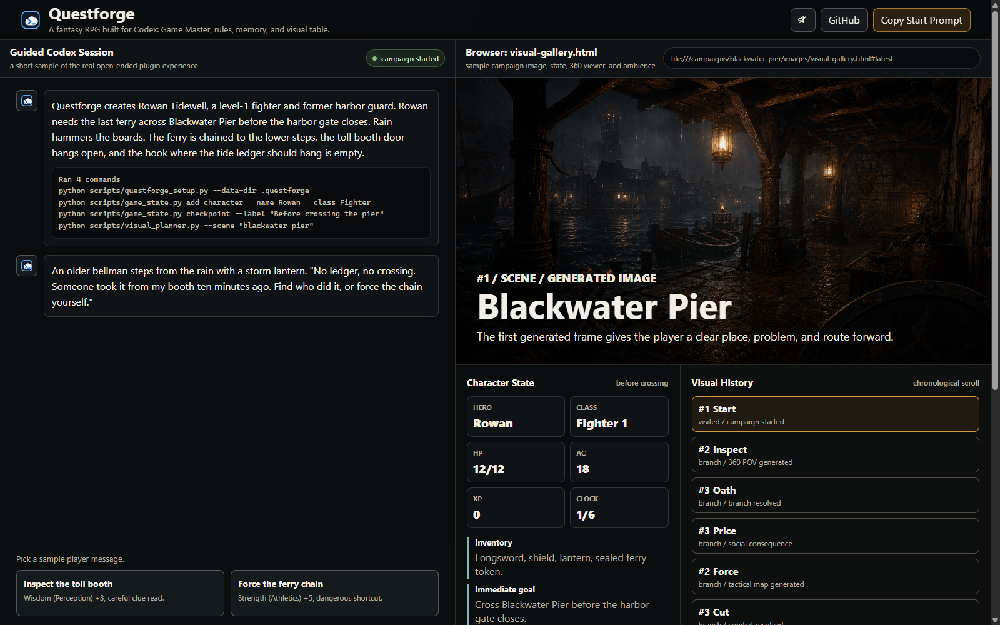

# Questforge



**What if we did not just use Codex to build a game, but used Codex to play it?**

Questforge is an open-ended fantasy RPG built for Codex. Codex becomes the Game Master, rules assistant, local state engine, and visual table. A normal conversation becomes a persistent 5E-compatible campaign with quick character creation, transparent dice, mechanical state, campaign memory, generated scenes, tactical maps, optional 360 views, and an original ambience pack.

**Guided sample session:** <https://adrianmelic.github.io/codex-questforge/>

The web page is a guided sample, not the full game. The actual game runs in an OpenAI task after installing the plugin, where the player can attempt anything and Questforge continues the world around that choice.

## Why It Is Different

Questforge is not a conventional browser game. Its play surface is the conversation itself: natural language replaces fixed dialogue menus, while local files make the campaign recoverable across turns and tasks.

Core features:

- instant or assisted level-1 character creation;
- atomic local quick-start from one structured spec, avoiding a chain of manual state writes before the first scene;
- original fantasy campaigns grounded in 5E-compatible SRD rules;
- offline English and Spanish core-rules indexes, with optional full SRD 5.2.1 indexing;
- persistent `game-state.json` for HP, AC, XP, inventory, equipment, shops, rests, spell slots, combat, conditions, death saves, and checkpoints;
- campaign memory for clues, NPCs, factions, locations, session logs, a player journal, and a DM-only adventure spine;
- transparent dice, varied difficulty classes, and failure-forward adjudication;
- native image generation for scenes, maps, items, comic panels, inventory views, and 360 POV panoramas;
- local visual history and panorama viewers on supported desktop surfaces;
- optional licensed ambience with a speaker toggle;
- chat-only fallback when local files or viewers are unavailable.

## How To Play

Install or enable Questforge, start a new task, and choose a natural-language opening:

```text
Start a new Questforge campaign with a quick hero.
```

```text
I am new to tabletop RPGs. Guide me through creating a hero, then begin.
```

```text
Quiero jugar a Questforge. Créame un personaje rápido y empezamos.
```

You can describe any action, ask what your character can do, inspect inventory, request a rules explanation, rewind to a checkpoint, or take the story in an unexpected direction. Questforge has been tested in English and Spanish and should follow the language of the conversation. Other languages use the English rules index when a localized SRD term is unavailable.

## Install

After public approval, install **Questforge** from the Plugins Directory in ChatGPT Work or Codex, then start a new task so its skills are loaded.

For source installation during development or review, add this repository as a marketplace:

```text
codex plugin marketplace add adrianmelic/codex-questforge
```

Then open **Plugins** in the ChatGPT desktop app, or `/plugins` in a current Codex CLI, install Questforge, and start a new task. The repository includes `.agents/plugins/marketplace.json`, `.codex-plugin/plugin.json`, and the complete skills bundle.

You can also ask Codex directly:

```text
Install the Questforge plugin from https://github.com/adrianmelic/codex-questforge, then start a new task so I can play it.
```

Official references: [Build plugins](https://learn.chatgpt.com/docs/build-plugins) and [Submit plugins](https://learn.chatgpt.com/docs/submit-plugins).

## First Run

The default setup is offline and installs no packages. During normal play, Questforge handles setup and the atomic campaign bootstrap. For manual review, from the project where campaign files should live:

```powershell
python scripts\questforge_setup.py --data-dir .questforge
```

It detects English or Spanish and builds local Markdown, JSONL, and SQLite indexes from the bundled core-rules primer. The game can begin immediately.

Detailed rules lookup can optionally download and index the official SRD 5.2.1 PDF:

```powershell
python scripts\questforge_setup.py --data-dir .questforge --full-srd
```

If `pypdf` is unavailable, Questforge keeps using the offline core index. Questforge never installs packages; complete extraction can be retried after the user prepares an environment that already contains `pypdf`.

The `.questforge/` directory is local runtime data and should not be committed.

Developers and reviewers can reproduce the complete local campaign scaffold in one command:

```powershell
python scripts/quick_start.py --workspace-root <play-workspace> --spec templates/quick-start-spec.json
```

The command creates campaign memory, hero state, equipment, checkpoint, minimum DM spine, opening brief, player journal, first session, analytics event, visual continuity, and the opening visual prompt. Native image generation remains a product-surface action and is not performed through an API key.

## What Codex Helped Build

Codex helped design, implement, test, and iterate on the full loop:

- plugin and skill architecture;
- SRD setup and local rules search;
- campaign memory and mechanical state;
- dice, difficulty, combat, inventory, level-up, and rollback helpers;
- visual planning, continuity, galleries, and 360 viewers;
- audio selection and optional ambience playback;
- narrative guardrails against repetitive AI-fiction motifs;
- deterministic self-play and human beta review workflows;
- long-form conversational playtests in English and Spanish, with structured event and state audits;
- installed-plugin smoke tests in English and Spanish.

The system was shaped through long-form playtests where Codex ran the campaign and the resulting conversation, timing, images, choices, and state files were audited afterward.

## Known Limitations

- The richest persistent experience requires a writable local workspace; ChatGPT Work can fall back to a conversation ledger when local files are unavailable.
- Native image generation is requested through the OpenAI product surface, not through an API key bundled with Questforge.
- Local galleries and 360 viewers are desktop aids. Static generated images remain the portable visual surface.
- Rules coverage defaults to the compact offline primer; complete SRD indexing is optional.
- Questforge is an unofficial fan tool, not an OpenAI or Dungeons & Dragons product.

## Development

Run the tests:

```powershell
$env:PYTHONDONTWRITEBYTECODE = "1"
python -m pytest tests -p no:cacheprovider
```

Validate the plugin and skills with the current `plugin-creator` and `skill-creator` validators before a release. Build the deterministic OpenAI Platform archive with:

```powershell
python scripts\package_plugin.py
```

The archive is written to `dist/`, which is intentionally ignored by Git.

## Repository Map

- `.codex-plugin/plugin.json` - plugin manifest and public install-surface metadata.
- `.agents/plugins/marketplace.json` - source marketplace for repo installation.
- `skills/` - runtime orchestration, setup, rules, campaign, puzzles, and visuals.
- `scripts/` - setup, rules search, dice, state, memory, visuals, audio, analytics, preflight, and packaging.
- `resources/core-rules/` - offline English and Spanish rules primers derived from SRD 5.2.1.
- `templates/` - campaign, journal, state, visual, audio, and puzzle templates.
- `assets/audio/starter-pack/` - curated Suno-generated ambience tracks.
- `submission/` - OpenAI Platform listing copy, prompts, test cases, and release notes.
- `docs/` - public site, playtest evidence, design notes, and visual guidance.

## Privacy, Terms, And Support

- [Privacy policy](https://adrianmelic.github.io/codex-questforge/privacy.html)
- [Terms of use](https://adrianmelic.github.io/codex-questforge/terms.html)
- [Support](https://adrianmelic.github.io/codex-questforge/support.html)
- [Security policy](SECURITY.md)

Questforge does not operate a publisher-controlled server or transmit campaign data to the publisher. Local campaigns can contain information the player entered; review them before sharing or committing them.

## License And Notices

Original code and plugin materials are MIT licensed. See `LICENSE`.

Questforge is unofficial and is not affiliated with, endorsed, sponsored, or approved by OpenAI or Wizards of the Coast LLC. Rules references are grounded in SRD material released under Creative Commons Attribution 4.0 International. See `NOTICE.md` and `docs/srd-sources.md`.

The starter audio pack contains curated tracks generated by Adrian Melic with Suno v5.5 while using a paid plan intended to grant commercial rights for newly generated outputs. See `assets/audio/README.md`.
